notes:This is a carton of NIST 1082, Cigarette Ignition Strength Standard. Ever heard of it? Probably not, unless you’re a fire safety enthusiast – which, weird flex, but ok.
---
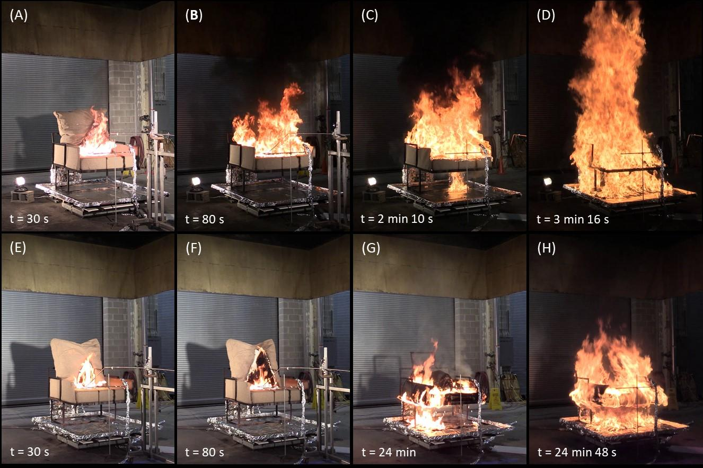
notes:The story behind NIST 1082 may surprise you, especially if you’re younger. For decades, the principal factor in fatal fires in the United States has been the ignition of soft furnishings such as beds and couches. A bed, for example, is both ignitable through common ignition sources – like a lit cigarette – and contains enough combustible material to rapidly fuel and grow a fire. A lit cigarette generates approximately 8 watts of heat. When dropped, or placed, on a bed or chair some of this heat keeps the cigarette smoldering, some is radiated to the surroundings, and the rest raises the heat of whatever it is touching.
---
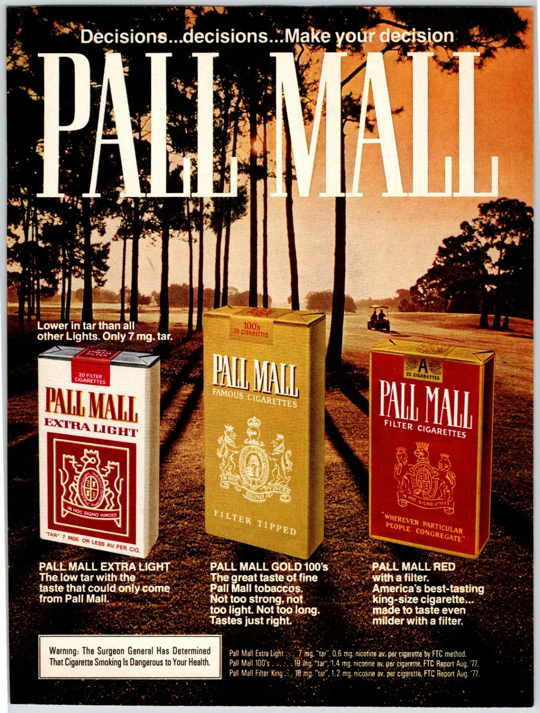</img>

notes:In 1976, the predecessor of NIST, the National Bureau of Standards, determined that an unfiltered king-size Pall Mall cigarette was the strongest igniting commercial cigarette on the market, and it became the de facto standard for ignition tests of soft furnishings. To ensure that mattresses, couches, chairs, and other soft furnishings wouldn’t just immediately go up in flame upon contact with a lit cigarette, some standardized tests were created.
---
</img>

notes:The thesis here – that we could reduce the amount of injuries or fatalities suffered by people falling asleep with a lit cigarette by testing how easily those furnishings ignited – was a solid one. NIST went further, though, and said “well, what if we could change the cigarette itself?”
---
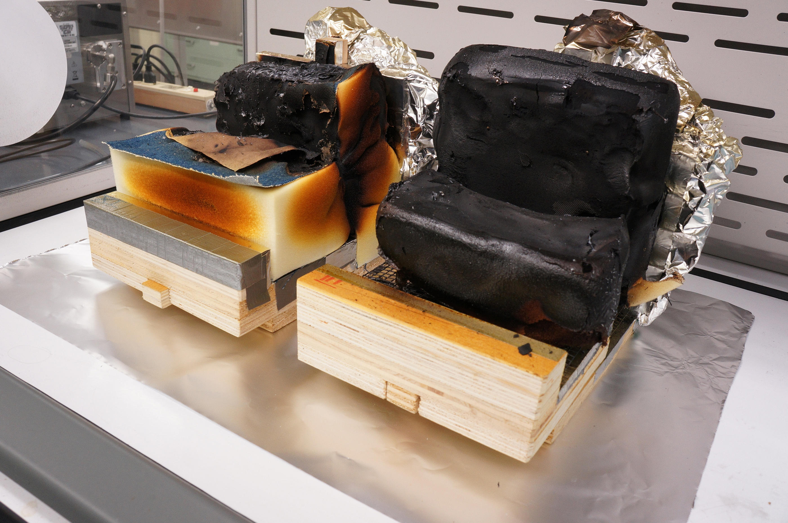</img>

notes: This is how NIST 1082 came to be. A collaboration between not just a standards organization, but also the private sector, building a safer cigarette. Researchers found that adding some cellulose bands to the paper would snuff out a lit cigarette if it wasn’t being drawn, without notably changing the flavor or the draw of the cigarette itself. Standard tests were created, like this one, to compare the efficacy of this new cigarette to the old standard.
---
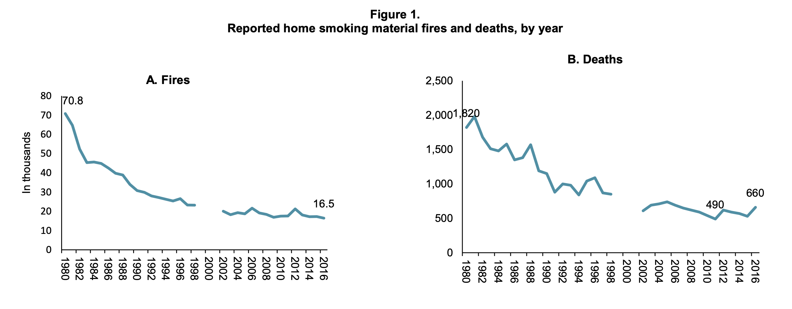</img>

notes: The result? States began to mandate cigarettes sold complied with the standard, and over the next few decades, a remarkable thing happened – between 1980 and 2010, fires starting in bedrooms and living rooms were more than cut in half.
---
</img>

notes:Rather than focus on just the outcomes, by making better mattresses, the standard focused on how we could reduce the likelihood of needing that safety net. From 2003 to 2011, the number of fatalities due to cigarette ignited fires was cut by 30%.
---
So, what the hell does this have to do with OpenTelemetry?

notes:So, what the hell does this have to do with OpenTelemetry? Glad you asked. This is the Hater’s Guide to OpenTelemetry.
---
</img>

Austin Parker

https://aparker.io

Director of Open Source, Honeycomb

OpenTelemetry Governance Committee

🦋 @aparker.io / 🐦 @austinlparker

notes:Hello everyone. I’m Austin Parker, Director of Open Source at Honeycomb, and a long-time maintainer of the OpenTelemetry project, and this is the Hater’s Guide to OpenTelemetry. If you’re an OpenTelemetry hater, lover, or anything in between, you’ll probably find something to enjoy here.
---
# Standards
## A Love Story

notes:I started off this talk with a story about standards, because when you get down to the heart of things, that’s what OpenTelemetry really is, and that’s what it’s been since the jump. I know we don’t call it that, but if you look at how, and why, work gets done in the project, it’s to those ends. Standards are a funny thing in software. They’re a lot like house rules in Monopoly; everyone has their own version, because the rules as written suck.
---
Standards often aren't!

notes:E-mail is a great example. Sure, your Gmail account supports SMTP, but so many things that we presume are a part of email - threads, for example - are really just client extensions; Affordances granted by product engineers trying to massage features onto rather low-level protocols.
---
We hack around standards - a lot.

```go
// Google sometimes returns "accounts.google.com" as the issuer claim instead of
// the required "https://accounts.google.com". Detect this case and allow it only
// for Google.
//
// We will not add hooks to let other providers go off spec like this.
// https://github.com/coreos/go-oidc/blob/6b94bec0d3f54b3546c663f6c1f4dd2620bf5d49/oidc/verify.go#L259
```

notes:I think standards often get a mixed reception in the industry, because we fall back on them as a bit of a panacea in discussion, but they’re often inconsistently implemented. OAuth and OIDC are standards, so is ActivityPub, but if you look at the implementation of those standards it’s a real mess. Go digging through some popular OAuth libraries and you’ll find all sorts of weird little one-offs because every provider can do things just a little bit differently. ActivityPub is this whole melange of stuff that, effectively, is held captive by whatever Mastodon wants to do with it. We don’t work in clean rooms, we’re subject to everyone else's decisions.
---
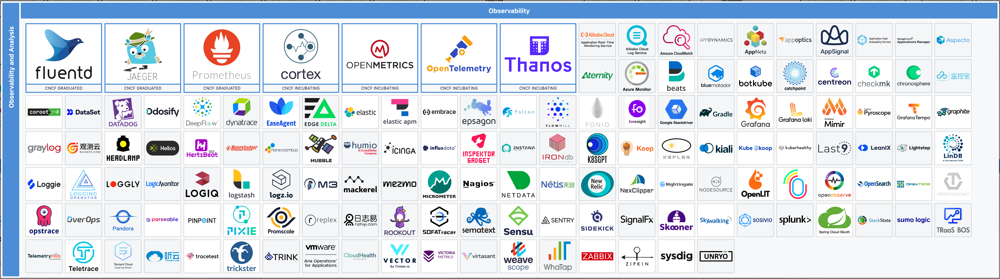</img>

_The Observability Wall_

notes:If we all could do clean sheet designs, life would be so much easier, yeah? Standards rarely have this luxury, especially when you’re trying to consolidate existing de facto standards – and there’s a lot of those in the telemetry world. StatsD, Prometheus, Micrometer, various logging formats, Zipkin, not to mention a whole host of proprietary segment or span based tracing formats, many of which are proprietary or custom-built.
---
## Thesis 1
### It's Unnecessary.

notes:This brings us to the first hater’s thesis about OpenTelemetry: It’s Unnecessary.
---
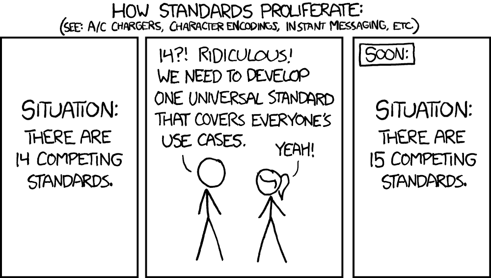</img>

notes:There’s a ton of prior art in the observability and monitoring world, most of which I just mentioned. Why build something new? For as much as we love to trot out this comic, there’s so many existing standards in the space, why not just focus on tracing and work with what everyone else is doing on metrics, or logs?
---
Collaboration > Competition

notes:The evidence shows that this approach doesn’t really work. There are more examples of great, innovative ideas that failed to gain purchase specifically because they required too heavy of a lift by half in order to interoperate with existing systems. Standards are slow, by design – they’re collaborative, not competitive.
---
OpenTelemetry is a threat.

notes:Some argue that you can’t actually have a meaningful standards-making process when you’re competing with incumbent technologies. I think that’s an interesting idea, because it does get to the heart of a point that is often overlooked, or minimized, when discussing OpenTelemetry. We are competition to the existing way of doing things, and are an existential threat to the business model of most vendors here.
---
```plaintext
┌────────────────────────────────────────────────────────────────┐
│                                                                │
│       Observability Workflows                                  │
│                                                                │
│       Query Projection                                         │
│                                                                │
│       Query Engine                                             │
│                                                                │
│       Storage Engine                                           │
│                                                                │
└────────────────────────────────────────────────────────────────┘
```
```plaintext
┌────────────────────────────────────────────────────────────────┐
│                                                                │
│       Telemetry Pipelines                                      │
│                                                                │
└────────────────────────────────────────────────────────────────┘
```
```plaintext
┌────────────────────────────────────────────────────────────────┐
│                                                                │
│       Telemetry Data                                           │
│                                                                │
└────────────────────────────────────────────────────────────────┘
```

notes:There’s a reason that telemetry is a moat, after all. The advantages of vertical integration between the data you’re generating, the ingest pipeline, how it’s stored, queried, and visualized are enormous. I’ve joked before that if everyone had endless free money and engineering time, OpenTelemetry wouldn’t have a single corporate contributor – everyone would write their own instrumentation libraries and agents. What’s interesting, though, is that I only think this holds true for vendors in the space – and only vendors. End-users of telemetry systems are far better served by having open standards and commodity telemetry.
---
## Thesis 2
### It's Boring.

notes:The second hater’s thesis about OpenTelemetry is thus: It’s Boring.
---
What color is your bikeshed?

notes:I don’t mean boring in the sense that it’s unexciting. If you like naming things, you’ll love OpenTelemetry! If you then like to rename things, you’ll also love OpenTelemetry!
---
We love stability! <!-- .element: class="fragment" data-fragment-index="1"> -->

No, really! <!-- .element: class="fragment" data-fragment-index="2"> -->

notes:But seriously, there have been people who said that we set our sights too small. In some ways, not entirely without merit.  In a pretty big way, OpenTelemetry is hemmed in by our insistence on compatibility. We set out some guidelines, early on, about stability – especially API stability. The last thing we want to do is tell framework and library developers to depend on an API that we then break. Worth noting here, we draw a distinction between the API and the SDK APIs, even if you might not.
---
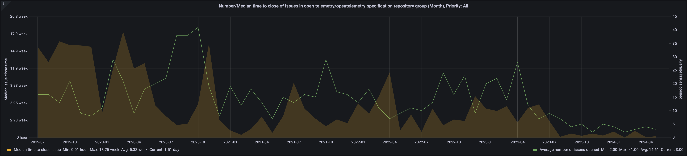</img>

notes:This insistence has led us to keep a lot of things in a ‘permanent beta’ state. I would argue that this isn’t really that bad, but it’s led to some bad outcomes. Let’s talk through a few. The best example I can think of is that much of the project is in a sort of zombie ‘80% done’ state.
---
Let's talk about semantic conventions, shall we?

notes:Semantic conventions are possibly the most relevant example to you, because they’re the cause of a lot of pain. Perhaps this should have been predictable – after all, who could have possibly predicted that naming things would be so controversial?
---
<video class="r-frame" data-autoplay data-src="./img/gource.webm"></video>

notes:Jokes aside, let’s take a straightforward example of how complicated this can be. HTTP Semantic Conventions recently mostly stabilized after, more or less, four years of work. The HTTP Span document has 16 merged contributors over that time period, and there’s a blame for nearly every single line in the document. HTTP Span conventions consist of 17 different stable attributes that represent the gamut of useful metadata about a request or response – the method, response headers, scheme, port number, and so forth. You may ask yourself, “how on earth could it take four years to come up with a standard for this?” and you wouldn’t be wrong… but there’s a lot of nuance there. Trying to not only thread the needle between subtle differences in how different languages implement HTTP servers and clients as well as how different consumers of tracing data need to interpret it means there’s a lot of little questions that need to be answered, and most of these questions don’t really come out in the initial design process. People don’t think about stuff until it breaks or they cut themselves on it. We need people to use OpenTelemetry in anger before they can use it in peace, and the process reflects that. Is a slow, deliberative pace good for users? Hard to say. If you think of OpenTelemetry as a required slog between you and using an analysis tool, then probably not. If you think of it as a step towards commodity instrumentation? I’d argue that it is.
---
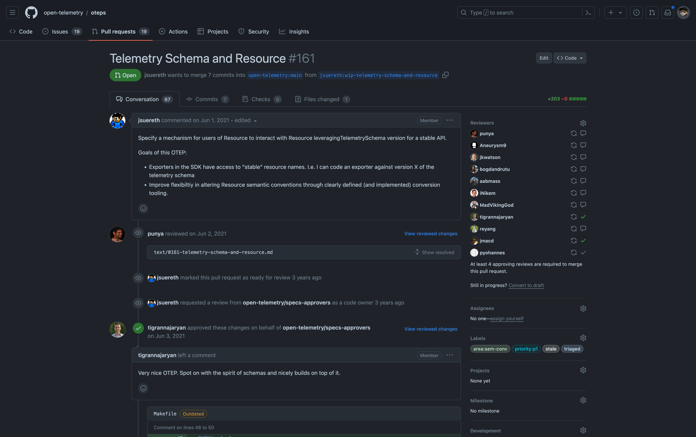</img>

notes:This pattern echoes throughout the project. Take a look at things like the schema transform processor in the OpenTelemetry Collector. It’s designed to allow you to inure yourself against schema changes by providing ways to upgrade or downgrade conventions as they change. One problem; It doesn’t really work like you’d hope it would. For example, what if a schema transformation would override an existing attribute value? What wins? This question was posted May 10th, 2023 – it remains unanswered. This effectively blocks further work on the processor. How would you know this, as a user? Well, first you’d need to know any of this stuff existed, which means you’d need to understand what each folder in the various collector repositories was for, you’d also need to know that documentation for those components are collected in READMEs in each folder, and you’d probably need to get pretty comfortable spelunking through GitHub issues and PRs to actually figure out what actually works at any given point in time… and this isn’t the exception, sadly, for most of the project. The core stuff all works pretty well, but once you get creative, there be dragons.
---
## Some Perspective.

notes:I don’t say this to put down anyone’s work or to diminish what we’ve accomplished – OpenTelemetry is a huge, complex, and sprawling project that is staffed by volunteers at the end of the day. We all have day jobs, and I’ve personally spent a non-zero amount of time and political capital over the years defending this project and the engineering time required for it to directors, vice presidents, founders, and CEOs. Just because it’s corporate OSS doesn’t mean that every contributor is paid for what they do, and quite often those contributors are having to wear multiple hats. I’m stating this, though, because this 80/20 problem has so many knock-on effects it’d make your head spin. Why does the documentation only exist in GitHub repos? Because we don’t want to commit time to writing docs for things that aren’t stable, and the people writing the docs are, again… volunteers. It’s a vicious cycle of prioritization,
---
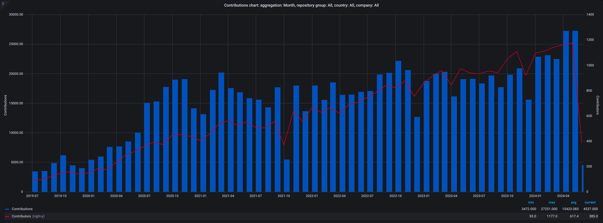</img>

notes:I think it’s worth noting as well that even with its warts, it’s hugely successful! Very, very large companies around the world are using OpenTelemetry, and using it successfully! We’re seeing it integrate into more libraries and frameworks every day. Want to trace your Docker Compose commands? Set some environment variables in your shell for OTLP export, or just run a local collector, and boom - the telemetry is just there!
---
## A Question:
Can commodities be innovative?

notes:Let me bring this back – I said earlier that the hater’s position on OpenTelemetry is that it isn’t innovative. I’d argue that it’s a fair cop, but only in the sense that we don’t talk about innovation much, because innovation isn’t in the standard itself – it’s in how you use the damn thing, and there’s precious little of that going around. Some of this is due to the fact that the various vendors and contributors to the project all have significant vested interests in their existing telemetry workflows, some of it is due to the fact that users themselves don’t know what they want until someone shows them a better way. There’s no actual bad guys here, just impedance mismatch.
---
### Everything Is An Event
#### (but in a good way)

- Traces... events with a schema. <!-- .element: class="fragment" data-fragment-index="1"> -->
- Metrics... events, over time. <!-- .element: class="fragment" data-fragment-index="2"> -->
- Logs... events with severity. <!-- .element: class="fragment" data-fragment-index="3"> -->

notes:First, let me say something that will make Honeycomb happy and everyone else groan – OpenTelemetry is built on events. Now, let’s flip it – OpenTelemetry isn’t built on arbitrary events. This is a pretty crucial distinction, but it’s something that gets missed a lot. Everything in the data model assumes that all telemetry is some kind of event, and your job as an instrumentor is to determine the semantics around those events. Traces? Those are just a collection of events with a schema. They’re structured logs! Metrics? Events, over time, with dimensions. Logs? We got two kinds – events with severity, or events in a registry.
---
It's all just structured data, but it's boring without aggregation.

notes:Here’s another thing that will make some people happy and some people sad; Most of these events are very boring unless you aggregate them, and OpenTelemetry does a lot of work to make sure that events are not only aggregable, but they’re aggregable at different parts of a pipeline and that the aggregations aren’t lossy. It took like three years to write a better metrics spec than Prometheus, not because we were snide, but because it’s literally impossible to combine two summaries together. Most of the things you find annoying and verbose exist for a reason, even if that reason may be hard to see because most tools don’t actually do anything with OpenTelemetry semantics yet.
---
🤷

notes:I admit, it’s kind of a cop-out to say “hey, look, I know this sucks now, but just wait until someone actually does stuff with it – then it’ll be swell!” I’m also biased from being too in-the-weeds on a lot of this stuff. Did you know that sometimes people are surprised to learn that you can have multiple pipelines in an OpenTelemetry Collector? Or, that you can tee the same pipeline to multiple exporters? There’s things I take for granted that aren’t really common knowledge!
---
## Thesis 3
### It Sucks.
notes:This brings me to the third, and final, hater’s thesis on OpenTelemetry: It Sucks.
---
# Well, kinda.

notes:Regretfully, I will hand this one to the haters, because it can be an extremely painful process to actually use the damn thing, although I will make some qualifications here. It sucks depending on what you’re trying to do. Let's talk about the most common complaint I hear -- the documentation.
---
When was the last time you looked at the docs?

notes: The good news is that the OpenTelemetry docs are the worst they’ll ever be – we’re making them better all the time! What’s interesting, and usually surprising to people, is that most of the docs problems are governance issues.
---
Lessons learned from OpenTracing and OpenCensus

notes:One learning we took from OpenTracing is that highly centralized project governance had some downsides. The API looked very samey from language to language, and often didn’t feel idiomatic to end-users. One of the first decisions we made in OpenTelemetry was to federate the implementation SIGs more, and strive for idiomatic implementations. This has been a mixed success, I’d say. Some languages, like Java and Python, have rolled with it. Others, less so. .NET is so idiomatic the API is mostly invisible, in favor of bindings to the core diagnostics library – but these decisions also make it harder for centralized documentation to be successful.
---
## What We Learned:
Governance is a leaky abstraction.

notes: For a very long time, SIGs have preferred to keep docs close to the code, as the code’s rate of change was very high. Many people don’t realize that there are quite a few sample applications and examples buried in language repos, although the conventions for these are hit or miss. Many more don’t realize that the documentation has gotten quite a bit better over the past couple of years, based on feedback from the community. What I see as a bigger gap is between expectations and what’s offered, though, and that gets to an interesting point about OpenTelemetry.
---
### Things people want/expect
- 'Drop in' solutions
- Outcome-driven documentation ("how do I get the right data for my use case?")
- Copy-paste example code

### Things we're designed for
- Holistic, full-system instrumentation
- Blending automatic and manual instrumentation
- Unopinionated about what you do with the data

notes:As an industry, we’ve trained people to think about observability from the outside-in. Things get marketed as high-level workflows, tightly scoped to a given telemetry signal or application. Log management and search, real user monitoring, application performance monitoring, digital experience management, whatever. OpenTelemetry is bottom-up – it defines signals and semantics for how to model telemetry data, and we’re very un-opinionated about what you do with that data afterwards. Maybe a better way to say it is that we do have strong opinions, but they’re weakly held enough that you can use it without knowing we even have them. This comes up a lot when we build out things like the Demo application – there’s no real pure OSS stuff that lets us show off what you can do, so there’s a tension between the art of the possible and making something that feels conventional to existing teams.
---
How many of you use the Collector?
How many of you like it?

notes:This echoes throughout the entire project, really. We have to balance “what do people expect” with “what do we want people to do”, and I’ll be the first to say that we don’t always find the right balance. A good example is the Collector – we expect that you’re gonna be using it, and we design around the presence of the Collector. I think if I polled people, though, they wouldn’t necessarily agree or even know. If we were more opinionated, and just said, “ok - hey, yeah, there’s always gonna be a collector in the middle” – then we could probably do a lot more to solve other pain points, like the SDK size, you know?
---
### Spoiler: This is a people problem, not a tech problem.

notes:I think it’s easy to look at OpenTelemetry and say that it’s broken, or that it sucks, or that it has problems or whatever – but it’s a lot harder to look inward and challenge our own assumptions and behaviors. I think this is just as true of OpenTelemetry maintainers and developers as anyone else, but it gets to a deeper problem in observability and monitoring today.
---
### The ARS Theorem
- Availability
- Resolution
- Speed

You can't even pick one, you're trading off.

notes:You’ve heard of consistency, availability, and partition tolerance – the CAP theorem? I’d suggest something for observability as well, the ARS theorem. Availability, resolution, and speed – the three tradeoffs in an observability system. You can take this model and stitch it together any which way you want, but ultimately you’re making tradeoffs between these three things. OpenTelemetry has to benefit people who are making various tradeoffs here, and do it in a way that doesn’t advantage or disadvantage anyone’s specific implementations or system designs.
---
</img>

notes:I want to pull this chart back from earlier. See, I omitted a key piece of data from this chart when I presented it to you. Want to guess what it is?
---
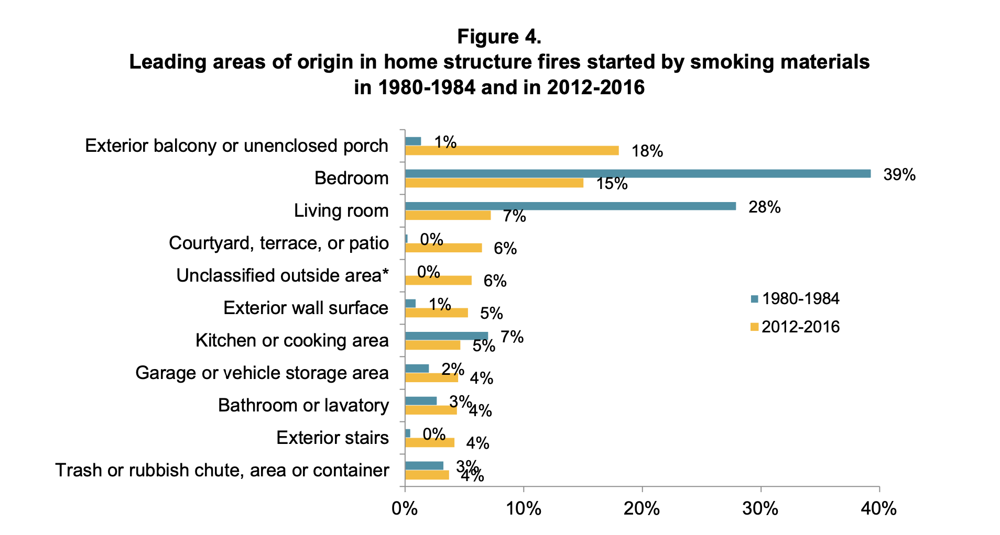</img>

notes:It’s true that significant reductions in fires started in bedrooms or living rooms happened, yes. It’s not necessarily true, though, that this is solely due to standards around non-igniting cigarettes. As you can see here, fires starting on porches increased 17 times! In fact, all of the decrease in bedrooms or living rooms was just spread out to things outside the house itself, because most places in the US banned indoor smoking, and people started using more smoke detectors.
---
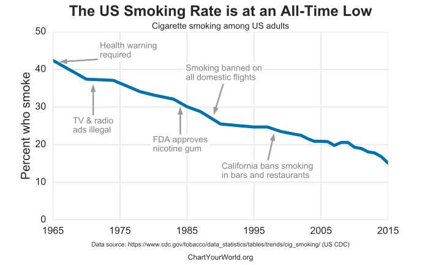</img>

notes:This makes it even more clear what’s happening here. Smoking bans caused huge changes in the amount of smokers in general, which obviously has a bigger effect on the amount of indoor fires caused by smoking.
---
## Standards
- They're not magic
- They're slow
- They can be kinda boring

We don't want to get in the way of users.

notes:It’s easy to get caught up in magical thinking around standards – or any tools, really. Sometimes they do feel unnecessary, like a belt and suspenders. Sometimes they’re boring, sometimes they’re hard to use. Despite all those critiques, why has OpenTelemetry been so widely adopted? Because it solves a real problem for people.
---
# People
## A Love Story

notes: This is the bigger point that I’d like you to leave with, really. OpenTelemetry isn’t going to succeed or fail because of its documentation, its wire format, its APIs, any of that. It’s going to succeed or fail based on its community, and what people do with it. If we lose sight of what matters to our users – if you, as observability practitioners, lose sight of what matters to your users – then we’ll have lost the plot. I don’t want that to happen. Personally, I have a lot riding on this project. Incidentally, we’re having a book signing tomorrow night…
---
You're the answer.

notes:Ok, ok. But seriously, the thing that matters most is that you succeed with it, that you take OpenTelemetry and run with it. There’s so much more that we can do together, as a community, than what we’ve been able to do so far. I can say from my own experience that the people building OpenTelemetry are committed, passionate, and laser-focused on building the best – maybe last? – observability framework that you’ll need. The standard itself is only half the battle, though. We need you to take the ball and run with it. Not just in terms of tools, but in terms of how you use it, what you’re monitoring, and why. The future of observability isn’t OpenTelemetry, it’s you.
---
## Thanks!

notes:Thank you for your time.
